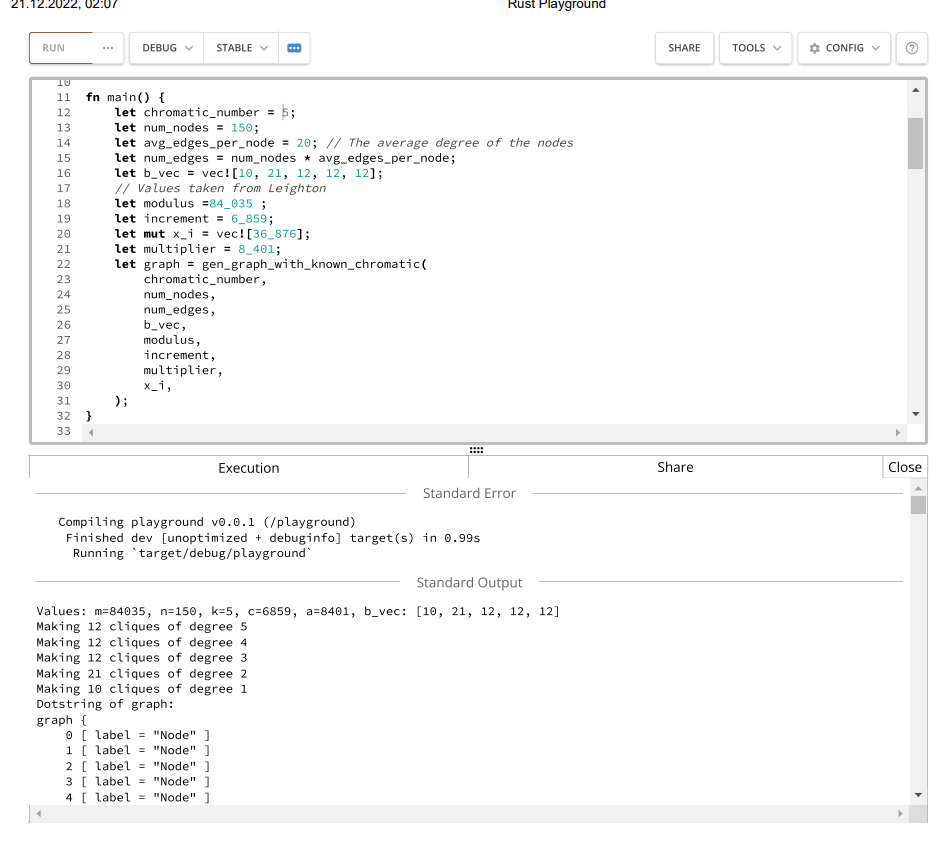

nume: Marin Iulia-Alina\
grupa: 321 CA

# -----Analiza algoritmilor----

## Colorarea grafurilor Tema18

### **_1.Algoritm Backtracking_**

sursa:[https://www.geeksforgeeks.org/m-coloring-problem-backtracking-5/]()

   Codul este preluat de din sursa, adaptat la un input de tipul (add edge) in loc\
sa primeasca input matrice. Am modificat codul sa nu intoarca raspunsul pentru k-colorare\
ci sa testeze pe rand colorarile cu un numar crescator de culori, pana la un numar maxim de\
   culori, dat de mine.

### **_2.Algoritm Greedy_**

sursa:[https://www.geeksforgeeks.org/graph-coloring-set-2-greedy-algorithm/]()

   Asemanator am prelucrat codul astfel incat sa primeasca acelasi tip de output de \
   tipul(add edge).

### **_3.Graph_**
   O clasa care implementeaza ce am nevoie pentru grafuri\\

### **_4.TestingAlgorithms_**
O clasa care testeaza prin comparatie cei 2 algoritmi\\

### _Fiesiere input:_

teste 1-3 : grafuri mici cu 20 noduri, numar cromatic 5, crescand numarul mediu\
de muchii per nod 

teste 4-6 : grafuri mici cu 20 noduri, numar cromatic 10, crescand numarul mediu\
de muchii per nod 

teste 7-9 : grafuri mici cu 20 noduri, numar cromatic aproximativ 20, crescand numarul mediu\
de muchii per nod. * Graful din testul 9 este complet(nr cromatic fix 20)

teste 10-12 : grafuri cu 150 noduri, numar cromatic 5, crescand numarul mediu\
de muchii per nod

test 13 : graf cu 150 de noduri, numar cromatic 10.

teste 14-15 : grafuri mici random

teste 16 si 17 : acelasi graf bipartit, dat in moduri diferite

teste 18 si 19 : grafuri bipartite (unul bun pentru greedy, unul nu)

test 20: graf random 450 noduri 
### _Generare fiesiere input:_

GraphGenerator.rs contine generatorul de grafuri in functie de numarul\
cromatic pentru grafuri mari.
Atasez aici un link catre un playground rust cu acest algoritm pentru\
generare online:\
[https://play.rust-lang.org/?version=stable&mode=debug&edition=2021&gist=9ef6c1c7a947fddfce496f6303b687c7](https://play.rust-lang.org/?version=stable&mode=debug&edition=2021&gist=9ef6c1c7a947fddfce496f6303b687c7)

